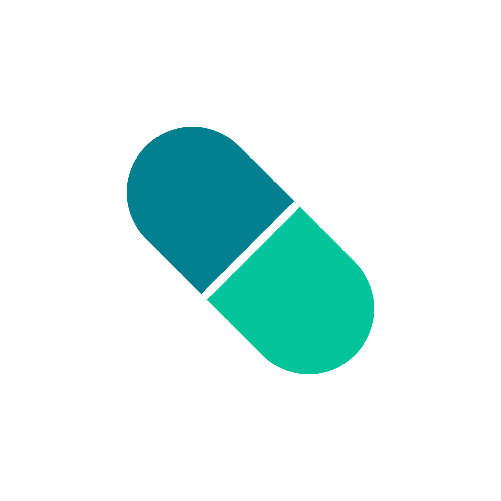
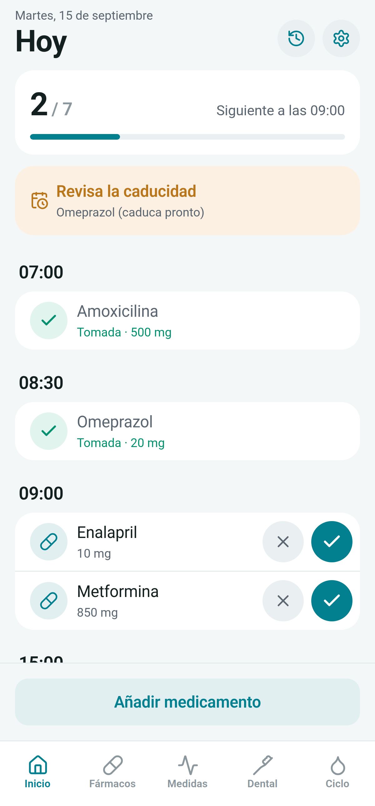
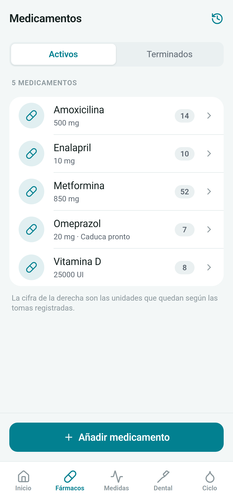
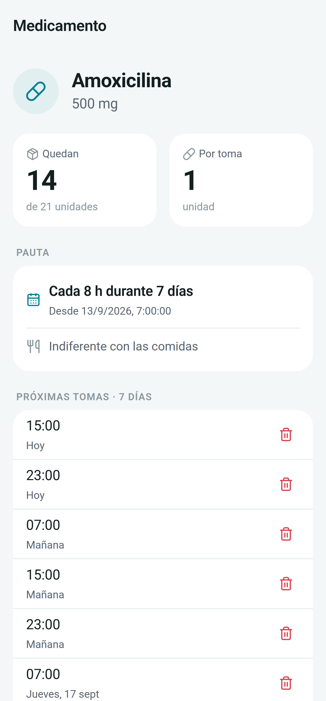
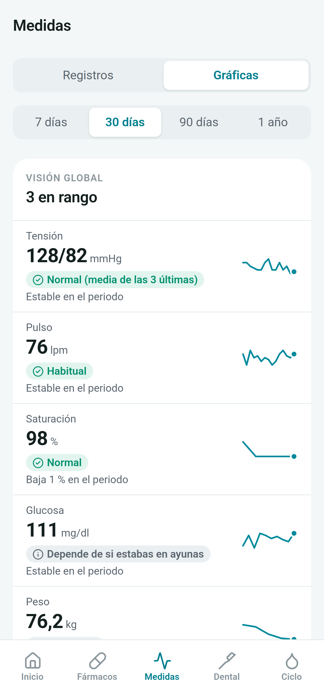
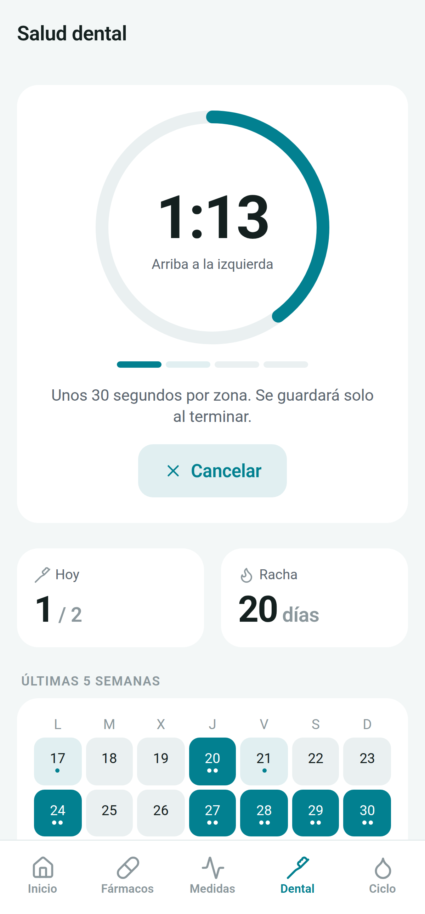
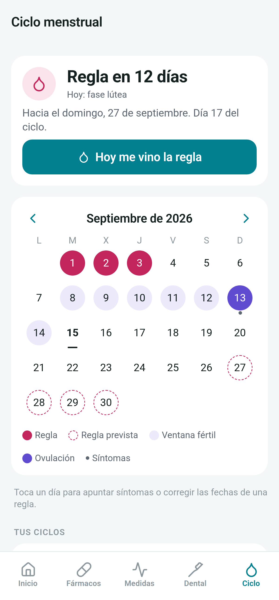
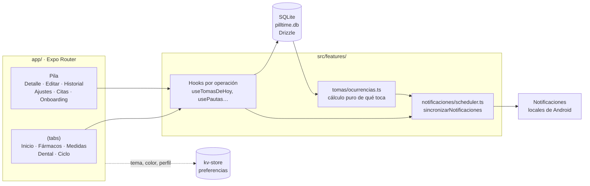

<div align="center">



# PillTime

**Tu medicación a su hora. Sin cuentas, sin servidores, sin conexión.**

App Android de salud personal para recordar la toma de medicamentos y llevar
un registro de tu salud. Todos los datos se quedan en tu móvil.

[](https://github.com/F3LIP3X/PillTime/releases/latest)
[](https://github.com/F3LIP3X/PillTime/releases)


[](LICENSE)

[**Descargar APK**](https://github.com/F3LIP3X/PillTime/releases/latest) ·
[Funciones](#funciones) ·
[Capturas](#capturas) ·
[Arquitectura](#arquitectura) ·
[Desarrollo](#desarrollo)

</div>

---

## Capturas

<div align="center">

| Agenda de hoy | Medicamentos | Detalle y pautas |
|:---:|:---:|:---:|
|  |  |  |

| Medidas y gráficas | Salud dental | Ciclo menstrual |
|:---:|:---:|:---:|
|  |  |  |

<sub>Capturas con datos de ejemplo inventados.</sub>

</div>

## Por qué PillTime

Las apps de recordatorio más conocidas piden cuenta, sincronizan tus datos de
salud con sus servidores o bloquean funciones básicas tras una suscripción.
PillTime parte de otra idea:

- **Privacidad total.** No hay registro, ni servidor, ni analítica. La base de
  datos es un SQLite dentro del móvil.
- **Funciona sin conexión.** Los avisos se programan en local; no depende de
  notificaciones push.
- **Gratuita.** Sin límite de medicamentos ni funciones de pago.

## Funciones

### 💊 Medicación
- **Agenda del día**: todas las tomas de hoy agrupadas por hora, con progreso
  (`3 / 5`), botones de *Tomado* / *Omitir* y las ya resueltas a la vista.
- **Pautas flexibles**: días de la semana a hora fija (indefinida o con fecha
  límite) o tratamientos "cada X horas durante N días". Un medicamento puede
  tener varias pautas.
- **Avisos agrupados**: varias tomas en el mismo minuto llegan en una sola
  notificación, con indicación de antes/después de comer.
- **Stock y caducidad**: unidades restantes calculadas a partir de las tomas y
  aviso 30 días antes de caducar.
- **Escáner de código de barras**: la app aprende cada código que registras y
  autocompleta el formulario la próxima vez.
- **Historial y PDF**: historial completo con edición de tomas y exportación
  a PDF para llevar a la consulta.
- **Tratamientos terminados**: se archivan solos al acabar, conservan su
  historial y se pueden reactivar.
- **Citas médicas**: agenda de las próximas consultas.

### 📈 Medidas de salud
- Tensión (sistólica, diastólica y pulso), glucosa, peso, saturación de
  oxígeno, ánimo y síntomas.
- Vista global con último valor, tendencia y una lectura orientativa (tensión
  según la guía ESH), y una gráfica por dato.

### 🪥 Salud dental
- Temporizador de 2 minutos guiado por 4 zonas, que sigue contando con la app
  en segundo plano.
- Racha de días y calendario de cepillados.

### 🌸 Ciclo menstrual *(opcional)*
- Registro de reglas y síntomas por día.
- Predicción de la próxima regla, ovulación y ventana fértil, con regularidad
  del ciclo.
- Modo SOP (síndrome de ovario poliquístico) que adapta los cálculos.
- Recordatorio opcional antes de la regla.

### 🎨 Personalización y accesibilidad
- Tema claro, oscuro o del sistema, y 6 colores de acento generados en OKLCH
  con contraste AA comprobado.
- El estado nunca se transmite solo con color: siempre va con texto o icono.

> [!IMPORTANT]
> PillTime es una herramienta de apoyo. No es un producto sanitario, no ofrece
> diagnósticos y las predicciones del ciclo no sirven como método
> anticonceptivo. Ante cualquier duda, consulta a un profesional de la salud.

## Instalación

1. Descarga el archivo `.apk` de la [última release](https://github.com/F3LIP3X/PillTime/releases/latest).
2. Ábrelo en el móvil y permite *instalar aplicaciones de origen desconocido*
   si Android lo pide.
3. Al terminar la bienvenida, acepta el permiso de notificaciones: sin él no
   suenan los avisos.

Requiere Android 7.0 (API 24) o superior.

## Stack

| Capa | Tecnología |
|---|---|
| Framework | [React Native](https://reactnative.dev) 0.86 + [Expo](https://expo.dev) SDK 57 |
| Navegación | [Expo Router](https://docs.expo.dev/router/introduction/) (rutas por archivos) |
| Lenguaje | TypeScript |
| Base de datos | SQLite (`expo-sqlite`) + [Drizzle ORM](https://orm.drizzle.team) con migraciones versionadas |
| Estado de UI | [Zustand](https://zustand.docs.pmnd.rs) (preferencias persistidas en el kv-store de SQLite) |
| Notificaciones | `expo-notifications` (locales, sin push) |
| Gráficas | `react-native-svg`, dibujadas a mano |
| Otros | `expo-camera` (códigos de barras), `expo-print` (PDF), `expo-keep-awake` |
| Builds | [EAS Build](https://docs.expo.dev/build/introduction/) en la nube |

## Arquitectura



Decisiones principales:

- **Una sola fuente de verdad para "qué toma toca"**: `calcularOcurrencias` es
  una función pura que usan la agenda, la generación de tomas y los avisos.
- **Avisos reprogramados desde SQLite**: tras cada cambio se cancela todo y se
  programan los próximos 14 días. Así una toma omitida o eliminada nunca
  vuelve a sonar.
- **Sin capa de caché ni React Query**: no hay red; los hooks leen de SQLite y
  se recargan al volver a cada pantalla.
- **Rendimiento con años de datos**: las listas de histórico paginan por
  cursor `(fecha, id)` con índices medidos con `EXPLAIN QUERY PLAN` sobre una
  base de unas 40.000 tomas.

<details>
<summary><b>Estructura del proyecto</b></summary>

```text
PillTime/
├── app/                    # Pantallas (Expo Router)
│   ├── (tabs)/             # Inicio, Medicamentos, Medidas, Dental, Ciclo
│   ├── medicamento/        # Alta, detalle y edición
│   ├── onboarding/         # Primera apertura
│   ├── cita/               # Citas médicas
│   ├── historial.tsx
│   └── ajustes.tsx
├── src/
│   ├── db/                 # Esquema Drizzle, cliente y migraciones
│   ├── features/           # Lógica por dominio: tomas, medicamentos,
│   │                       # notificaciones, medidas-salud, ciclo, dental…
│   ├── components/         # UI compartida (Button, Card, TextField…)
│   ├── stores/             # Zustand (solo estado de UI y preferencias)
│   └── theme/              # Colores, paletas OKLCH, tipografía, espaciado
├── assets/                 # Icono, adaptive icon y splash
└── docs/                   # Plan técnico, análisis de competencia, capturas
```

</details>

## Desarrollo

Requisitos: Node.js 20.19.4+ (o 22/24) y la app [Expo Go](https://expo.dev/go) o una
development build instalada en el móvil.

```bash
git clone https://github.com/F3LIP3X/PillTime.git
cd PillTime
npm install --legacy-peer-deps

npm start                 # Metro para Expo Go (túnel)
npm run start:dev-client  # Metro para una development build
npm run typecheck         # Comprobación de tipos
npm run db:generate       # Nueva migración a partir de src/db/schema.ts
```

> [!NOTE]
> `expo-notifications` no funciona en Expo Go para Android. Para probar los
> avisos hace falta una development build (`npm run build:dev`).

### Builds

Las builds se compilan en la nube de EAS:

```bash
npm run build:apk   # APK instalable (perfil preview)
npm run build:dev   # Development build
```

La documentación técnica completa está en [`docs/plan-tecnico-diseno.md`](docs/plan-tecnico-diseno.md)
y el estudio de mercado, en [`docs/analisis-competencia.md`](docs/analisis-competencia.md).

## Licencia

Copyright © 2026 Felipe Toledano Escudero. **Todos los derechos reservados.**

El código es visible para consulta, pero no se permite usarlo, copiarlo,
modificarlo ni redistribuirlo sin autorización escrita. Consulta
[`LICENSE`](LICENSE).

## Autor

**Felipe Toledano Escudero**

[](https://github.com/F3LIP3X)
[](https://www.linkedin.com/in/felipe-toledano-escudero/)
